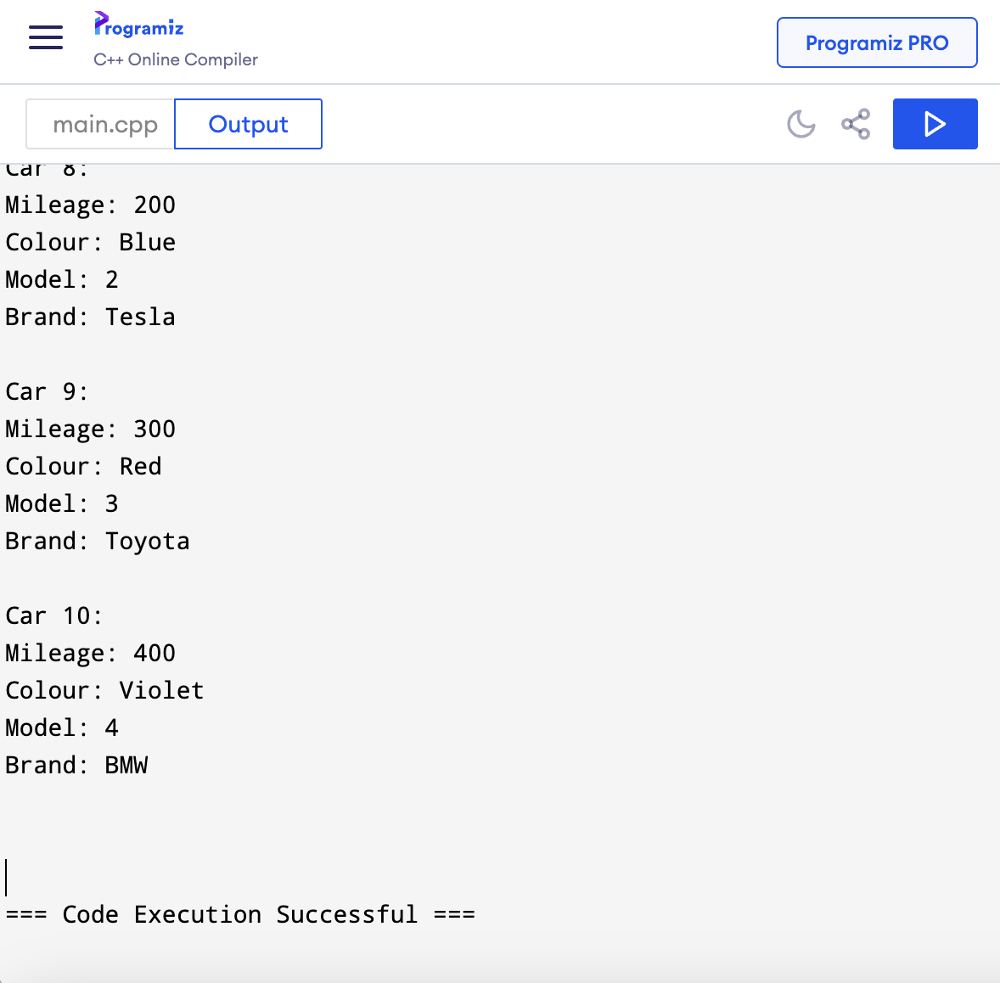
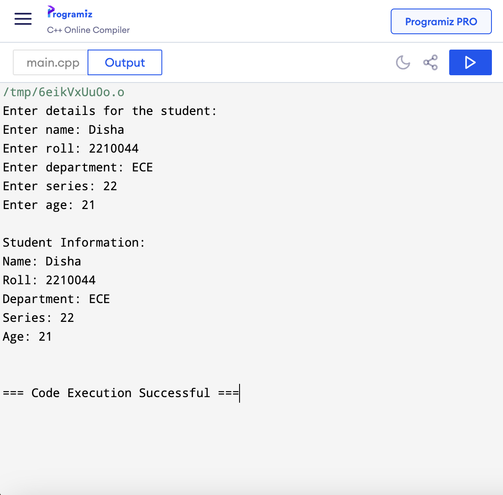

## **Experiment No : 05**

## **Experiment Name : Implementation of Classes, Access Specifiers, and Data Handling in C++**

## **Submission Date : September 09, 2024**


---

## **Theory :**
In C++, classes are used to organize data and functions together in one place. A class is like a blueprint for creating objects, which are instances of that class. This makes the code easier to manage and reuse.

Access specifiers, such as private, public, and protected, control who can access the data and functions inside a class. Private means only the class itself can use that data or function, while public allows outside access. This helps protect important data and ensures it's only used in the right way.

Data handling in classes happens through objects. Each object stores its own data based on the class structure, and we can use functions (called methods) inside the class to get, change, or compare that data. Using access specifiers makes sure that the data is secure and handled properly, making C++ a good choice for organizing and managing data.

## **Problem 1 : Write a code in C++ to compare the speed of three cars using access specifier**

## **Code :**
```C++
#include<iostream>
#include<string>
using namespace std;

class Car1{
    private:
    string name = "Nissan";
    int speed = 100;
    public:
    void show(){
        cout << name << endl;
    }
    int getSpeed (){
        return speed;
    }
};

class Car2{
    private:
    string name = "Honda";
    int speed = 200;
    public:
    void show(){
        cout << name << endl;
    }
    int getSpeed (){
        return speed;
    }
};

class Car3{
    private:
    string name = "BMW";
    int speed = 300;
     public:
    void show(){
        cout << name << endl;
    }
    int getSpeed (){
        return speed;
    }
};

int main(){
    Car1 car1;
    Car2 car2;
    Car3 car3;
    
    cout << "The Fastest Car is: ";
    
    if(car1.getSpeed() > car2.getSpeed() && car1.getSpeed() > car3.getSpeed()){
        car1.show();
    } 
    else if (car2.getSpeed() > car1.getSpeed() && car2.getSpeed() > car3.getSpeed()){
        car2.show();
    }
    else{
        car3.show();
    }
    return 0;
}
```

## **Output :**


## **Discussion :**
This code has three car classes (Car1, Car2, Car3), where the name and speed attributes are private, meaning they can't be accessed directly. Public methods show() and getSpeed() are used to access the car's name and speed. In the main function, the speeds are compared, and the name of the fastest car is displayed.


<br>


## **Problem 2 : Write a code in C++ to store and display information for ten cars, including mileage, colour, model and brand.**

## **Code :**
```C++
#include <iostream>
#include <string>
using namespace std;

class Car {
public:
    int mileage;
    string colour;
    string model;
    string brand;

    void input() {
        cout << "Enter mileage: ";
        cin >> mileage;
        cout << "Enter colour: ";
        cin >> colour;
        cout << "Enter model: ";
        cin >> model;
        cout << "Enter brand: ";
        cin >> brand;
    }

    void display() {
        cout << "Mileage: " << mileage << endl;
        cout << "Colour: " << colour << endl;
        cout << "Model: " << model << endl;
        cout << "Brand: " << brand << endl;
    }
};

int main() {
    Car cars[10];

    for (int i = 0; i < 10; i++) {
        cout << "Enter details for car " << i + 1 << ":" << endl;
        cars[i].input();
    }

    cout << "\nCar Information: " << endl;
    for (int i = 0; i < 10; i++) {
        cout << "Car " << i + 1 << ":" << endl;
        cars[i].display();
        cout << endl;
    }

    return 0;
}
```

## **Output :**


## **Discussion :**
This code defines a Car class to manage and display information such as mileage, color, model, and brand for 10 cars. It collects user input for each car and then prints the details, demonstrating how to use arrays and class methods to handle multiple objects effectively.

<br>

## **Problem 3 : Write a code in C++ to display the details of a university student, including department, roll number, name, series, and age.**

## **Code :**
```C++
#include <iostream>
#include <string>

using namespace std;

class Students {
public:
    string name;
    int roll;
    string department;
    int series;
    int age;

    void input() {
        cout << "Enter name: ";
        cin >> name;
        cout << "Enter roll: ";
        cin >> roll;
        cout << "Enter department: ";
        cin >> department;
        cout << "Enter series: ";
        cin >> series;
        cout << "Enter age: ";
        cin >> age;
    }

    void display() {
        cout << "Name: " << name << endl;
        cout << "Roll: " << roll << endl;
        cout << "Department: " << department << endl;
        cout << "Series: " << series << endl;
        cout << "Age: " << age << endl;
    }
};

int main() {
    Students student;

    cout << "Enter details for the student:" << endl;
    student.input();

    cout << "\nStudent Information: " << endl;
    student.display();

    return 0;
}
```

## **Output :**


## **Discussion :**
This code defines a Car class to manage and display information such as mileage, color, model, and brand for 10 cars. It collects user input for each car and then prints the details, demonstrating how to use arrays and class methods to handle multiple objects effectively.


