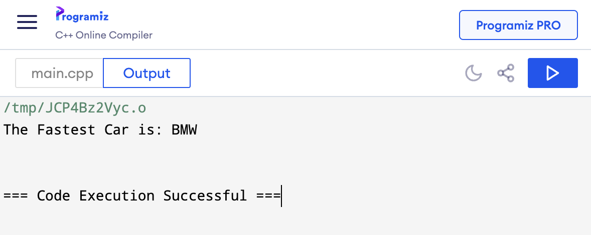

## **Experiment No : 05**

## **Experiment Name : Implementation of Classes, Access Specifiers, and Data Handling in C++**

## **Submission Date : September 09, 2024**


---

## **Theory :**
This experiment focuses on implementing object-oriented programming concepts in C++ by creating classes to manage data for cars and students. It highlights the use of access specifiers to control access to attributes and methods. Additionally, the experiment demonstrates the display and comparison of object data through method calls.

## **Problem 1 : Compare the speed of three cars using access specifier**
## **Code :**
```C++
#include<iostream>
#include<string>
using namespace std;

class Car1{
    private:
    string name = "Nissan";
    int speed = 100;
    public:
    void show(){
        cout << name << endl;
    }
    int getSpeed (){
        return speed;
    }
};

class Car2{
    private:
    string name = "Honda";
    int speed = 200;
    public:
    void show(){
        cout << name << endl;
    }
    int getSpeed ()
        return speed;
    }
};

class Car3{
    private:
    string name = "BMW";
    int speed = 300;
     public:
    void show(){
        cout << name << endl;
    }
    int getSpeed (){
        return speed;
    }
};

int main(){
    Car1 car1;
    Car2 car2;
    Car3 car3;
    
    cout << "The Fastest Car is: ";
    
    if(car1.getSpeed() > car2.getSpeed() && car1.getSpeed() > car3.getSpeed()){
        car1.show();
    } 
    else if (car2.getSpeed() > car1.getSpeed() && car2.getSpeed() > car3.getSpeed()){
        car2.show();
    }
    else{
        car3.show();
    }
    return 0;
}
```

## **Output :**



